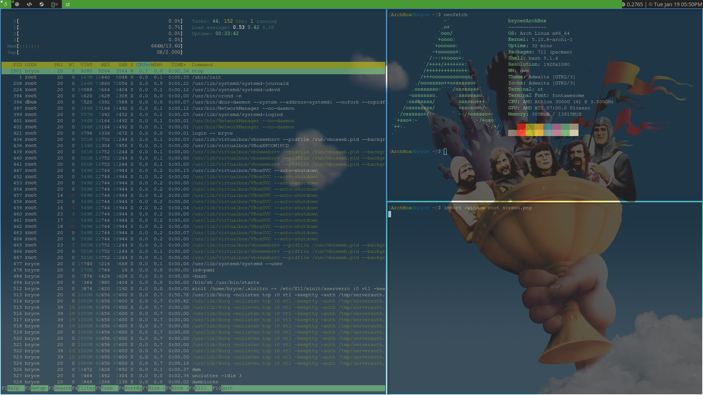

# My build of dwm (Dynamic Window Manager)
I use this to build dwm on my computers, but anyone can use it.

## Needed packages, programs, fonts, etc.
- `fontawesome`: A font for custom icons
- `opensans`: A sans style font
- `libxft-bgra`: (optional) Very useful for unicode and emoji support
- `dmenu`: (optional) Not needed but very useful
- `st`: (optional) A pretty useful terminal emulator that fits dwm

## How to install/build
```
git clone https://github.com/ncvfg234560/dwm.git
cd dwm
sudo make clean install
```

## Screenshot(s)

